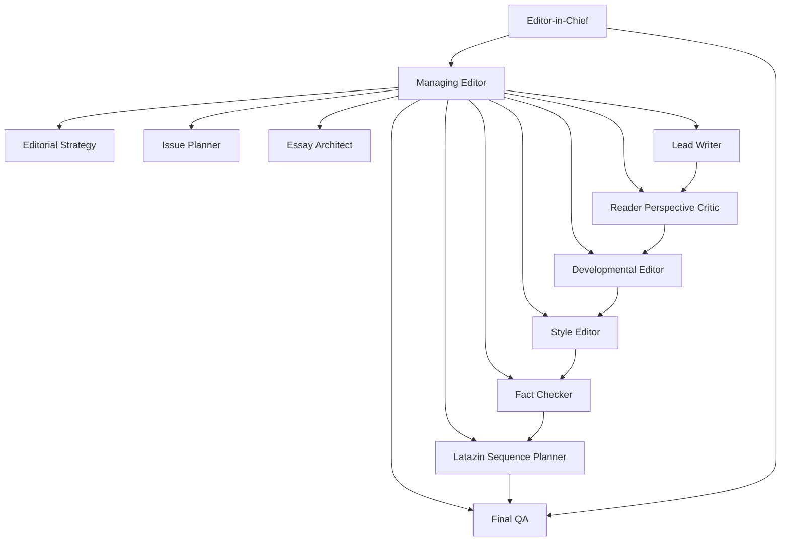

# Poblysh Editorial Agentic Team

This folder defines the sub-agent architecture for The Poblysh Journal.

The goal is not to create many agents that all try to write. The goal is to
create an editorial organization with protected responsibilities, real
checkpoints, and structured dissent.

## Core Principle

No single agent should be allowed to define, write, critique, edit, and
approve the same piece alone.

The team gains quality by dividing protection duties:

- one protects the worldview
- one protects the issue architecture
- one protects narrative interest
- one protects prose quality
- one protects factual integrity
- one protects stylistic consistency
- one protects the reader's experience
- one protects final release quality

## MVP Team

This system starts with 12 agents:

1. `editor_in_chief`
2. `managing_editor`
3. `editorial_strategy`
4. `issue_planner`
5. `essay_architect`
6. `lead_writer`
7. `reader_perspective_critic`
8. `developmental_editor`
9. `style_editor`
10. `fact_checker`
11. `latazin_sequence_planner`
12. `final_qa`

## Organigram

## Folder Guide

- `team-principles.md`: shared rules for dissent, taste, and responsibility
- `workflow-states.md`: allowed states for issue and article movement
- `handoff-contracts.md`: what each agent must receive and produce
- `planning/`: orchestration notes and rubrics
- `agents/`: one role brief per agent
- `templates/`: intermediate artifact templates

## Operating Rule

Agents should not all touch every piece at every stage.

Preferred order:

1. planning agents first
2. writing agents next
3. reader critique before heavy editing
4. editing agents after critique
5. integrity checks before packaging
6. sequence planning after text stabilizes
7. final QA last

## How Workflows Should Use This Folder

`create-editorial-plan-for-month.md` should use:

- `editorial_strategy`
- `issue_planner`
- `essay_architect`
- `reader_perspective_critic`
- `editor_in_chief`

`create-article.md` should use:

- `essay_architect`
- `lead_writer`
- `reader_perspective_critic`
- `developmental_editor`
- `style_editor`
- `fact_checker`
- `final_qa`

`create-latazin-pages-sequence-plan.md` should use:

- `latazin_sequence_planner`
- later, optionally, a future `visual_pairing` agent if the team expands
